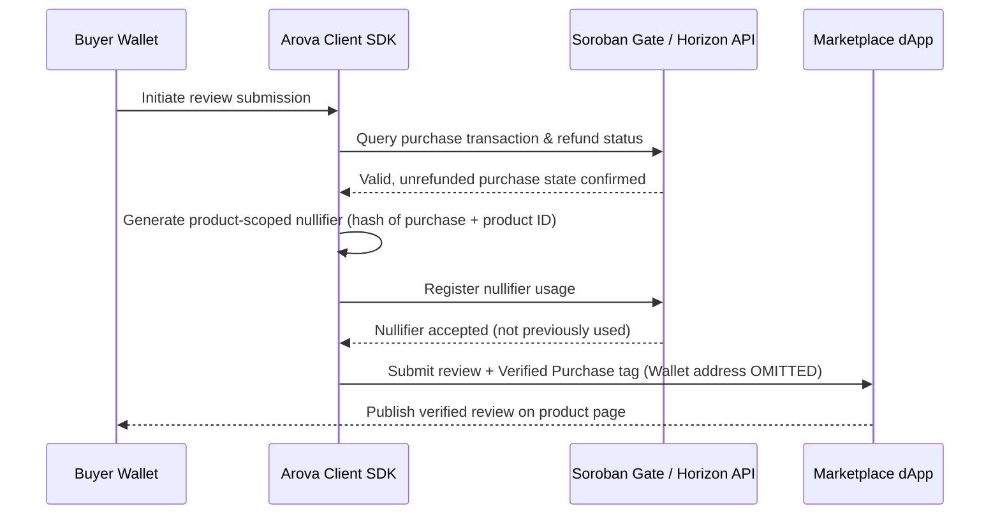
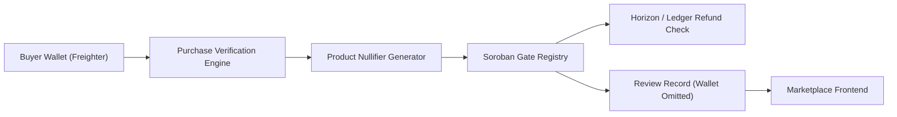

<div align="center">
  
  <h1>Arova</h1>
  <p>Private review-eligibility gate for Stellar marketplace applications.</p>

  <a href="https://stellar-arova.vercel.app/"></a>
  
  
  
  
</div>

---

Arova is a Stellar Testnet reference implementation and product design for **wallet-minimized review eligibility**.

A marketplace dApp can verify that a reviewer actually purchased a product without obtaining the buyer's public Stellar wallet address. The marketplace receives a verified purchase signal and a product-scoped nullifier to prevent double-reviewing.

> [!IMPORTANT]
> Arova is **not an anonymity system**. It does not hide IP addresses, network timing, browser fingerprints, or transaction data on public Stellar ledgers. It strictly enforces the documented privacy boundary: marketplace applications receive review eligibility proofs without attaching the buyer's public Stellar wallet address to the public review record.

---

## What Is Arova?

Arova provides a private review-eligibility gate for decentralised e-commerce and digital marketplaces built on Stellar.

Instead of requiring buyers to sign public reviews directly with their primary wallet (exposing their entire transaction history to the public), Arova decouples purchase verification from public identity:

```text
Buyer Stellar Wallet
  ↓
Purchase Verification & Nullifier Generation
  ↓
Soroban Eligibility Gate Check (Unrefunded & Active)
  ↓
Marketplace receives: Verified Purchase Tag + Product Reference (Wallet Address OMITTED)
```

Arova handles:
- **Purchase Verification**: Confirming authentic transactions on Stellar.
- **Product-Scoped Nullifiers**: Guaranteeing one valid review per purchase while preventing cross-product tracking.
- **Refund Awareness**: Ensuring refunded or revoked orders cannot generate new verified reviews.
- **Wallet Address Minimization**: Keeping buyer wallet addresses out of the public review store.
- **Soroban Integration**: Utilizing Soroban smart contracts on Stellar for verifiable state checks.

---

## Core Flow



---

## Architecture



### Stack

- **Frontend & Landing Page:** Next.js 16 (App Router), React 19, Tailwind CSS, Framer Motion.
- **Smart Contracts:** Soroban Smart Contracts on Stellar Testnet.
- **Blockchain Connectivity:** Stellar Horizon API & Soroban RPC.
- **Wallet Support:** Freighter Wallet (Stellar Testnet).
- **Design System:** Custom dark-mode grid rails (`GridRails`, `GridFrame`).

---

## 5-Step Verification Lifecycle

1. **Purchase**
   - The buyer completes a valid purchase on Stellar. The purchase transaction is recorded on the ledger.
2. **Prove**
   - The buyer generates a proof of eligibility and a product-scoped nullifier. The buyer's public wallet address is kept inside the local client boundary.
3. **Verify**
   - Arova verifies the purchase status against Soroban state and Horizon ledgers, ensuring the transaction is valid and unrefunded.
4. **Publish**
   - The marketplace accepts the review, attaching a `Verified Purchase` badge and product reference. The buyer's wallet address is **never** included.
5. **Prevent Reuse**
   - The product-scoped nullifier is recorded in state to prevent duplicate reviews from a single purchase transaction.

---

## Threat Model & Privacy Boundaries

### What Arova Protects
- **Public Linkability**: Prevents tying a buyer's public Stellar wallet address directly to public review comments.
- **Double Reviewing**: Product-scoped nullifiers enforce one review per purchase without enabling cross-product tracking.
- **Refund Exploitation**: Prevents refunded or cancelled purchases from generating verified review badges.

### Out of Scope (What Arova Does NOT Protect)
- **Network Metadata**: IP addresses, HTTP headers, or network-level observers.
- **Public Ledger Visibility**: On-chain payment transactions between buyer and seller remain visible on the public Stellar ledger.
- **Seller Knowledge**: Sellers who correlate exact purchase timestamps with review publication times may deduce identity.

---

## Local Development

### Requirements
- Node.js 20.x or later
- npm

### Installation

```bash
# Clone the repository
git clone https://github.com/sayyidusy15/stellar-arova.git
cd stellar-arova

# Install dependencies
npm install

# Run development server
npm run dev
```

Open [http://localhost:3000](http://localhost:3000) with your browser to see the result.

### Build Verification

```bash
# Run production build
npm run build
```

---

## Project Structure

```text
stellar-arova/
├── public/                     # Static assets & Arova logo
│   ├── logo-arova.png          # Primary Arova Brand Logo
│   ├── mesh-gradient/          # Background grid gradients
│   └── sow/                    # Instawards Statement of Work
├── src/
│   ├── app/                    # Next.js 16 App Router (layout, page, docs)
│   ├── components/             # Reusable UI components
│   │   └── monitor/            # Landing page modules (Hero, Navbar, Statement, etc.)
│   ├── context/                # React context providers
│   └── data/                   # Documentation and static copy
├── README.md                   # Product documentation
└── package.json
```

---

## Specification Reference

This implementation follows the **Arova Instawards Statement of Work (SOW)** guidelines for product scope, terminology, privacy boundaries, and verification flow.

- **Primary Repository**: [https://github.com/sayyidusy15/stellar-arova](https://github.com/sayyidusy15/stellar-arova)
- **License**: MIT
